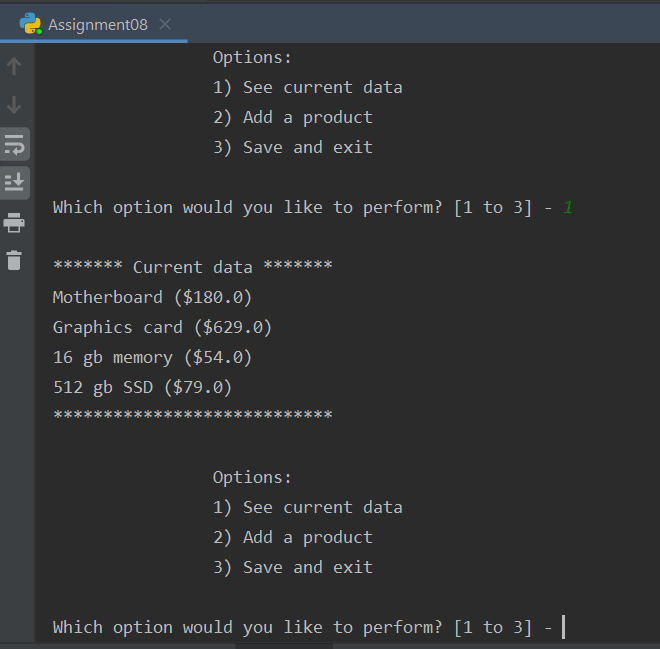
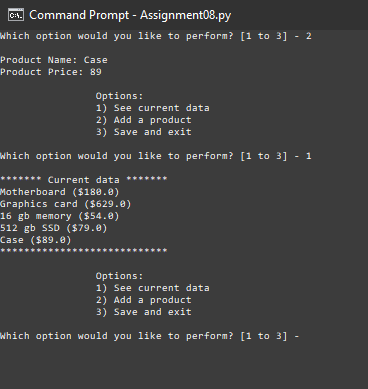

Matthew Kojetin  
06/08/20  
IT FDN 100 A  
Assignment 08  
https://github.com/matthewkojetin/IntroToProg-Python-Mod08   

# Module 08: Working with classes
## Introduction
Creating scripts with custom classes is a simple way to organize data and sets of functions. Following the standard pattern of components of a class helps you customize how data behaves, and you can run multiple instances of a class using objects.

## Classes
Classes are a way of grouping functions. They can contain multiple functions, referred to as methods.

### Using data directly
Enter classes name, then any variables or constants are designated after a `.`.

You can use a function from within a class in the same way, if a method is a `@staticmethod` you can call it directly, and it gets loaded into memory.
The disadvantage of a static method is that you can have only one instance of it in memory.

## Class vs object
If you create an object first, then call a method or object from a class. When you do this you are working with a unique instance of the class.

## Components of a standard pattern of a class
Classes typically contain fields, a constructor, attributes, properties, and methods (Figure 1).

```Python
# -- Fields --
# -- Constructor --
#     -- Attributes --
# -- Properties --
# -- Methods --
```
***Figure 1. Pseudocode/comments used to organize the components of a function in a script.***

### Fields
Fields are data members of a class. Variable or constant that is inside of a class. You most often work with it indirectly by using the assignment operator (Figure 2).

```python
class Person()
  # -- Fields --
  strName = ""

obj = Person()
obj.strName = "Matthew" # Using the strName field indirectly.
```
***Figure 2. Initializing a field in the Person() class, then using it indirectly.***

### Constructor
Methods that automatically run when you create an object from the class (also sets initial values of the field, also called the initialization method of the class). This is set using the "dunder" name `__init__(self)`. If you don't have a constructor, you don't have to pass anything in. Passing in the initial value goes into the constructor so you can use them (Figure 3).

In the same way, you can use a destructor to delete an instance of a class using `__del__(self)`. That code is run whenever the instance of the class goes out of scope. It's generally not used.

```python
    def __init__(self, product_name, product_price):
```
***Figure 3. Example of constructor syntax.***

### Self keyword
Used when you want to use objects within a class indirectly. Once you create an object instance of a class, the `self` keyword helps identify which instance in memory is being referred to.

When you add a parameter to a constructor, you need to set the first value as `self`.

### Attributes
Virtual fields within a constructor.

### Properties
Used for managing field or attributes. Typically includes a getter (using `@property` syntax) and a setter (using `@field_name.setter` syntax) (Figure 4).

```Python
@property
def product_price(self):
    return str(self.__product_price)

@product_price.setter
def product_price(self, value):
    self.__product_price = value
```
***Figure 4. Getter and setter for product_price attribute.***

### Methods
Another name for functions within a class.

## Assignment 08 script
To complete this assignment I started by pulling in code from previous assignments, based on the pseudocode provided.

For the Product class I followed the format and syntax from the module notes pretty closely to ensure I was using the same patterns. Where I varied was in the `__str__` method, where I added formatting to clean up the way the product name and price were presented when called later (Figure 5).
```python
# -- Methods --
def __str__(self):
    return self.product_name + " ($" + str(self.product_price) + ")"
```
***Figure 5. Formatting product name and price in the Product class.***

In the FileProcessor class I used pickling to save and retrieve data from the file, largely recycling the code from previous assignments.

In the IO class I created methods to accomplish the necessary tasks, `menu_choice()`, `print_menu()`, `show_data()`, and `new_product`.

The script runs in PyCharm (Figure 6).  
  
***Figure 6. Script running in PyCharm.***

The script runs in the Windows command prompt (Figure 7).  
  
***Figure 7. Script running in Windows command prompt.***

## Summary
By designing a class, you can set the properties of data to be used by multiple objects, creating a layer of abstraction. You can also specify the format of objects within a class and initialize values that make your code more suitable for reuse.
